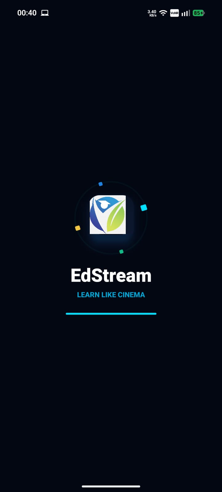
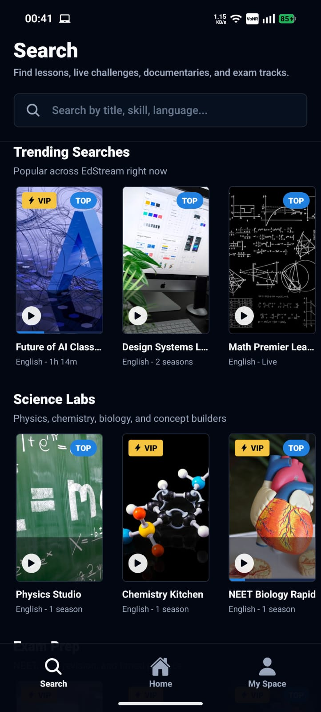
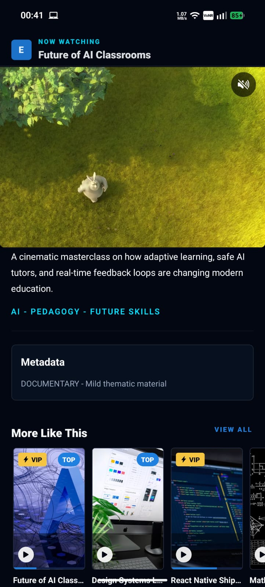

<div align="center">
  

  <h1>EdStream</h1>
  <p>
    A premium education streaming app built with Expo SDK 57, inspired by the polish,
    motion, and content discovery patterns of Disney+ Hotstar and JioHotstar.
  </p>

  <p>
    
    
    
    
  </p>
</div>

<br />

<div align="center">
  <table>
    <tr>
      <td align="center"></td>
      <td align="center"></td>
      <td align="center"></td>
      <td align="center"></td>
    </tr>
  </table>
</div>

## Experience

EdStream turns learning content into a streaming-first product experience. The app opens with an animated, theme-aware splash screen, lands on a Hotstar-style Home feed, supports Learn and Practice content modes, and keeps Search, Home, and My Space in a polished bottom tab layout.

The detail screen is built around a pinned autoplay video area, scroll-aware metadata, a reanimated header, native video controls, landscape fullscreen support, mute feedback, and related learning rails.

## Highlights

<table>
  <tr>
    <td width="50%">
      <h3>Streaming-Style Home</h3>
      <p>Fixed Learn and Practice mode buttons, banner content, centered stack carousel, categorized rails, pull-to-refresh, and skeleton loading states.</p>
    </td>
    <td width="50%">
      <h3>Video Detail Screen</h3>
      <p>Autoplay video, pinned playback area, animated header, safe status-bar spacing, fullscreen landscape support, and metadata that scrolls independently.</p>
    </td>
  </tr>
  <tr>
    <td width="50%">
      <h3>Search by Category</h3>
      <p>Fixed search input, category-wise default content, horizontal rails, skeleton loading, and query feedback such as "Showing results for ...".</p>
    </td>
    <td width="50%">
      <h3>My Space</h3>
      <p>A clean profile area with learning progress, saved preferences, quick actions, and a premium dark/light theme-compliant layout.</p>
    </td>
  </tr>
  <tr>
    <td width="50%">
      <h3>Theme + Polish</h3>
      <p>System light/dark mode support, Paper theme alignment, NativeWind styling, theme-aware splash background, and app icon using the splash mark.</p>
    </td>
    <td width="50%">
      <h3>Native Interactions</h3>
      <p>Expo Haptics on tab switching, content actions, card presses, search controls, profile actions, retries, and video mute/unmute.</p>
    </td>
  </tr>
</table>

## Tech Stack

<table>
  <tr>
    <td><strong>Runtime</strong></td>
    <td>Expo SDK 57, React Native 0.86, React 19.2.3</td>
  </tr>
  <tr>
    <td><strong>Navigation</strong></td>
    <td>Expo Router with root stack, dynamic detail route, and three bottom tabs</td>
  </tr>
  <tr>
    <td><strong>Styling</strong></td>
    <td>NativeWind, React Native Paper, Expo Linear Gradient, shared theme tokens</td>
  </tr>
  <tr>
    <td><strong>Media</strong></td>
    <td>expo-video for playback, expo-image for cached posters and artwork</td>
  </tr>
  <tr>
    <td><strong>Motion</strong></td>
    <td>React Native Reanimated, animated splash, detail header interpolation, carousel stack mode</td>
  </tr>
  <tr>
    <td><strong>Feedback</strong></td>
    <td>expo-haptics, skeleton loaders, empty states, error retry states</td>
  </tr>
</table>

## Current App Structure

```txt
src/
+-- app/
|   +-- _layout.tsx
|   +-- (tabs)/
|   |   +-- _layout.tsx
|   |   +-- index.tsx
|   |   +-- search.tsx
|   |   +-- profile.tsx
|   +-- detail/
|       +-- [mediaId].tsx
+-- components/
|   +-- feedback/
|   |   +-- AnimatedSplash.tsx
|   |   +-- EmptyState.tsx
|   |   +-- ErrorState.tsx
|   |   +-- Skeleton.tsx
|   +-- layout/
|   |   +-- Screen.tsx
|   +-- media/
|       +-- HeroBanner.tsx
|       +-- LearningVideoPlayer.tsx
|       +-- MediaCard.tsx
|       +-- MediaRail.tsx
|       +-- MetadataPill.tsx
+-- data/
|   +-- apiService.ts
|   +-- mockMedia.ts
+-- features/
|   +-- detail/
|   |   +-- components/DetailAnimatedHeader.tsx
|   |   +-- hooks/useMediaDetail.ts
|   +-- home/
|       +-- hooks/useHomeFeed.ts
+-- theme/
|   +-- AppTheme.tsx
|   +-- paperTheme.ts
|   +-- tokens.ts
+-- types/
|   +-- media.ts
+-- utils/
    +-- formatRuntime.ts
    +-- haptics.ts
    +-- listPerf.ts
    +-- tabBar.ts
```

## Key Screens

<table>
  <tr>
    <td><strong>Search</strong></td>
    <td>Browse all mock learning content by category, or filter with a fixed search bar.</td>
  </tr>
  <tr>
    <td><strong>Home</strong></td>
    <td>Initial active tab with Learn/Practice switching, hero banner, stack carousel, rails, refresh, and skeleton states.</td>
  </tr>
  <tr>
    <td><strong>My Space</strong></td>
    <td>Profile dashboard for saved progress, preferences, quick actions, and account-style learning stats.</td>
  </tr>
  <tr>
    <td><strong>Detail</strong></td>
    <td>Dynamic route with pinned autoplay video, scrollable metadata, animated header, and related content.</td>
  </tr>
</table>

## Setup

Expo SDK 57 targets Node.js `22.13.x` or newer.

```bash
npm install
npm run start
```

Run on a native target:

```bash
npm run android
npm run ios
```

Run web:

```bash
npm run web
```

## Verification

```bash
npx tsc --noEmit
npm run lint
```

For native app icon, splash screen, video plugin, or Android build property changes, rebuild the native project:

```bash
npx expo run:android
```

## Expo SDK 57 Notes

This project follows the Expo SDK 57 package set:

- Expo `~57.0.1`
- React Native `0.86.0`
- React `19.2.3`
- TypeScript strict mode
- Expo Router file-based navigation
- Expo Haptics, Video, Image, Splash Screen, Status Bar, and System UI modules

## Polish Checklist

- [x] Three-tab navigation: Search, Home, My Space
- [x] Home is the initial middle tab
- [x] Learn and Practice mode switching
- [x] Banner and reanimated stack carousel
- [x] Category-wise Search screen
- [x] Refresh skeletons and loading states
- [x] Detail screen with pinned autoplay video
- [x] Landscape fullscreen video support
- [x] Animated detail header
- [x] Theme-aware splash screen
- [x] Light/dark mode support
- [x] Haptics on key actions and tab switching
- [x] App icon aligned with splash icon

---

<div align="center">
  <strong>EdStream</strong>
  <br />
  Premium learning, presented like streaming.
</div>
